# Bienvenido a Jobsy 👋

## Tabla de Contenidos

- [Características](#características)
- [Instalación](#instalación)
- [Uso](#uso)
- [Pantallas](#pantallas)

## Características

Jobsy es una aplicación que conecta a reclutadores con profesionales.
Los reclutadores publican una oferta de trabajo, los profesionales swipean la oferta y si al reclutador le guasta el perfil del profesional entonces swipea a este produciendose el match.

## Instalación

- Para instalar las dependencias del proyecto ejecutar
  npm install

- Para correr la aplicación ejecutar
  npx expo start

## Uso

- Abrir la aplicación en el emulador o en tu dispositivo.

- Crear una cuenta o iniciar sesión.

### Inicio de sesión como reclutador

- mail: recruiter@mail.com
  contraseña: indistinto

### Inicio de sesión como profesional

- mail: dev@mail.com
  contraseña: indistinto

Navegar por las distintas secciones de la app.

Explorar las funcionalidades principales.

## Pantallas

### Inicio

<table>
  <tr>
    <td></td>
    <td></td>
    <td></td>
  </tr>
  <tr>
    <td colspan="3" align="center">
    La pantalla de inicio permite .....
    </td>
  </tr>
</table>

### Perfil de Usuario

<table>
  <tr>
    <td>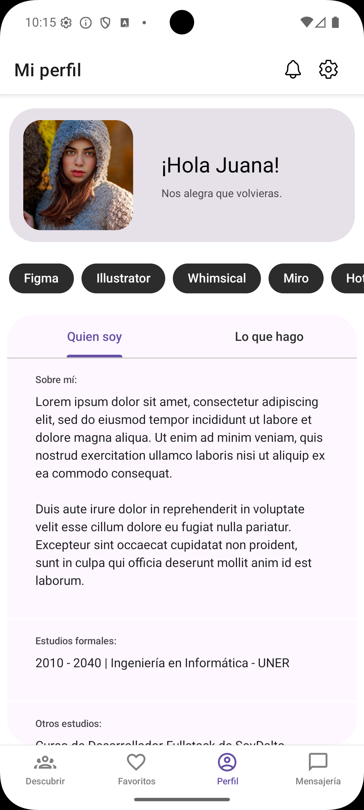</td>
    <td>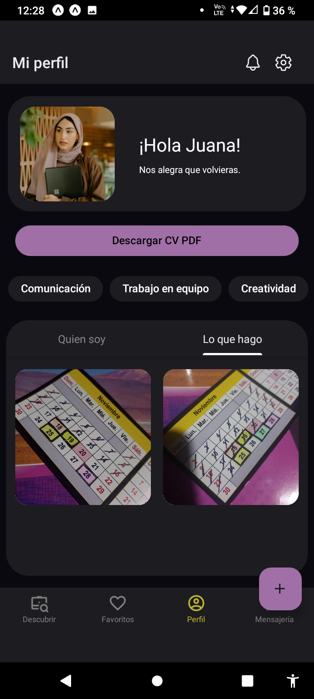</td>
    <td>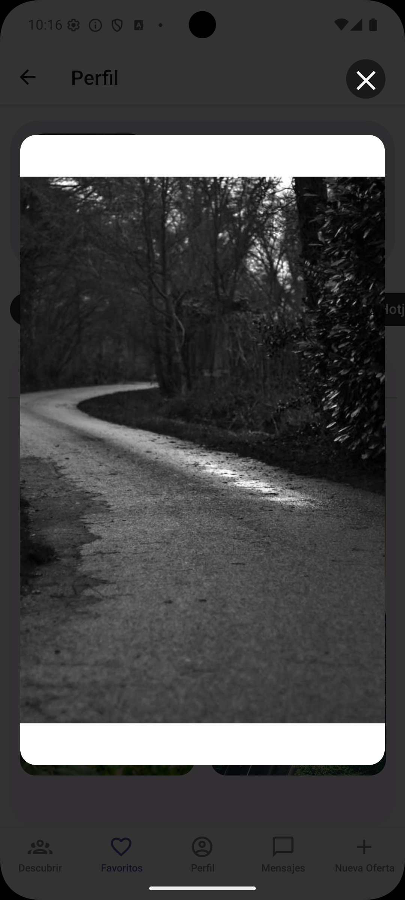</td>
  </tr>
  <tr>
    <td>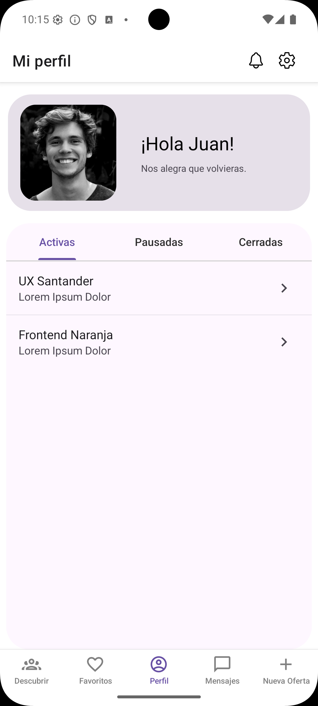</td>
    <td>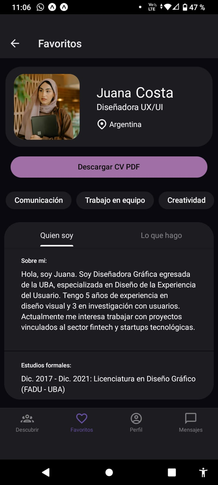</td>
    <td>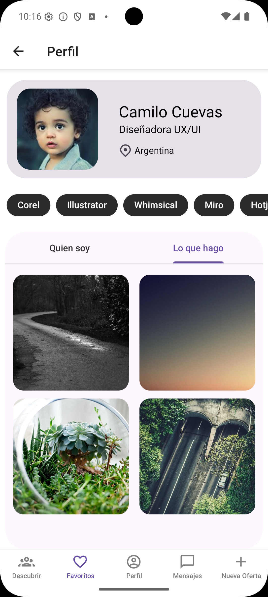</td>
  </tr>
  <tr>
    <td colspan="3" align="center">
     En la sección de perfil, los usuarios profesionales pueden brindar una breve descripción de sí mismos, sus habilidades, experiencia laboral, estudios realizados e información de contacto. Además pueden compartir imágenes de su portfolio mostrando sus trabajos realizados, intereses o capturas de su día a día. En cuanto a los usuarios reclutadores mostráran un resumen de las ofertas laborales que hayan disponibilizado en la plataforma, tanto búsquedas activas como cerradas a modo de historial.
    </td>
  </tr>
</table>

### Mensajería

<table>
  <tr>
    <td>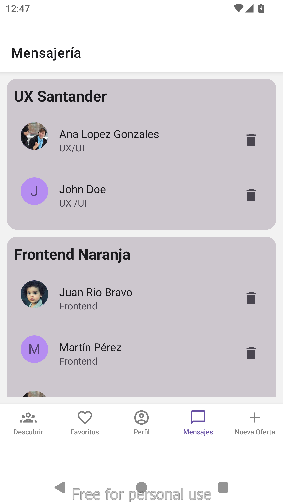</td>
    <td>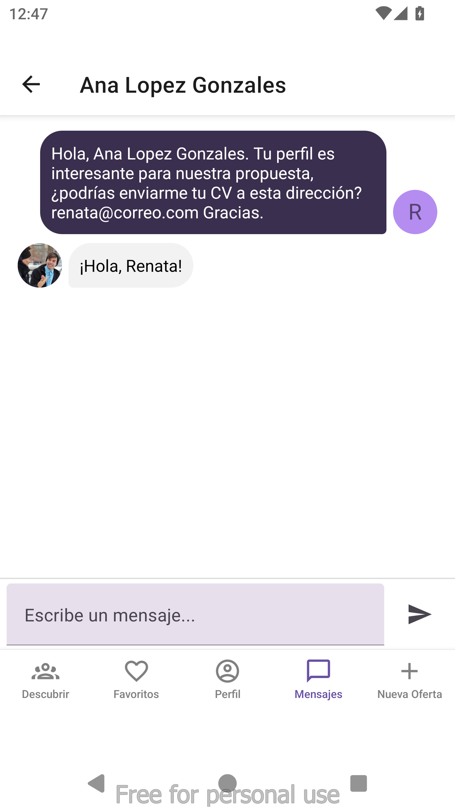</td>
    <td>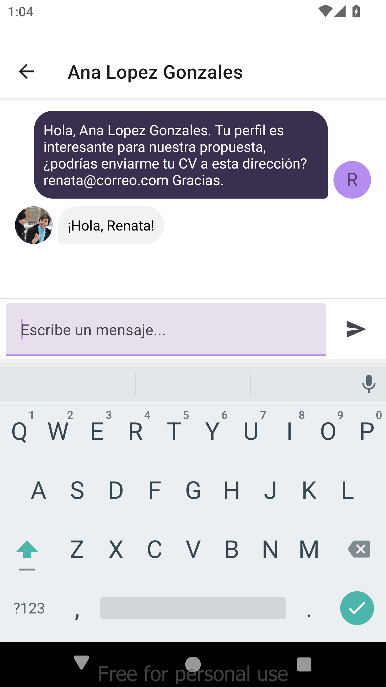</td>
     <td>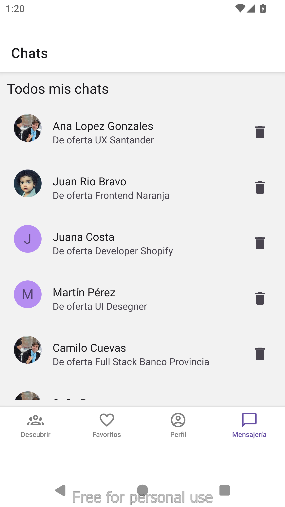</td>

  </tr>
  <tr>
    <td colspan="3" align="center">
      La sección de mensajería permite la comunicación entre usuarios, con diseño limpio y burbujas de chat intuitivas.
      Los chats para el reclutador estan agrupados por oferta, permitiendo de esta manera que todo este ordenado de forma visual.
      Los chats para el profesional están todos juntos, debajo del nombre del reclutador se encuentra el nombre de la oferta por la que se esta comunicando.
      También permite eliminar contactos de la mensajería.
    </td>
  </tr>
</table>

### Favoritos - reclutadores

<table>
  <tr>
    <td></td>
    <td>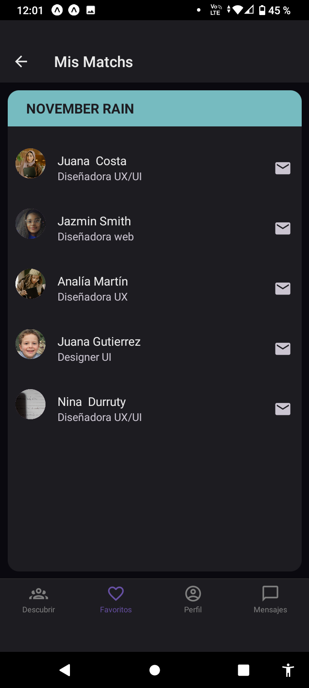</td>
    <td></td>
    
  </tr>
  <tr>
    <td colspan="3" align="center">
      La sección Favoritos posee una sección destacada con los 10 últimos match con profesionales, desde allí se puede acceder al perfil de los mismos.
      También tiene una lista de las ofertas que tienen Match odenados por oferta, al entrar a una oferta se accede al listado de profesionales, desde allí se puede acceder al perfil del profesional o a la mensajería además de poder eliminarlo de la lista.
    </td>
  </tr>
</table>

### Favoritos - profesionales

<table>
  <tr>
    <td>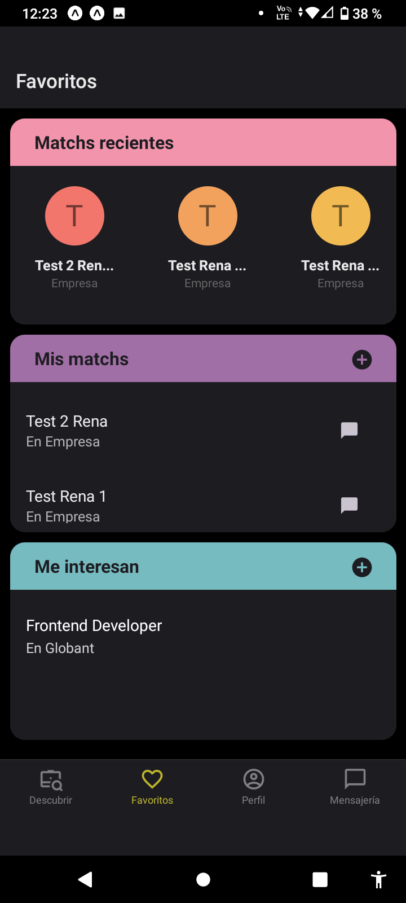</td>
    <td></td>
    <td>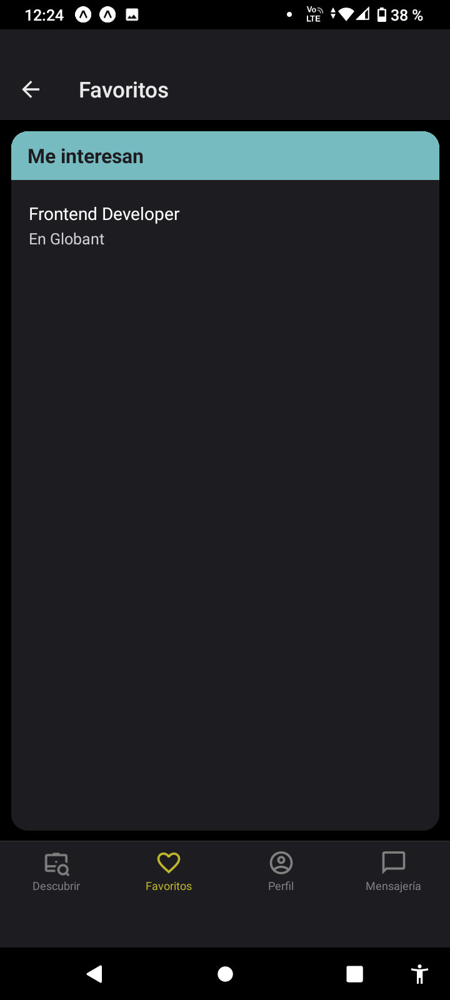</td>
    
  </tr>
  <tr>
    <td colspan="3" align="center">
    La pantalla Favoritos presenta 3 secciones: 
      1- Matchs recientes: muestra los últimos 10 matchs con acceso a su detalle.
      2- Mis matchs: previsualiza las 2 últimas coincidencias y permite ir a la lista completa.
      3- Me interesan: previsualiza las 2 últimas postulaciones y permite acceder a la lista completa.
  </td>

  </tr>
</table>

### Nueva Oferta

<table>
  <tr>
    <td>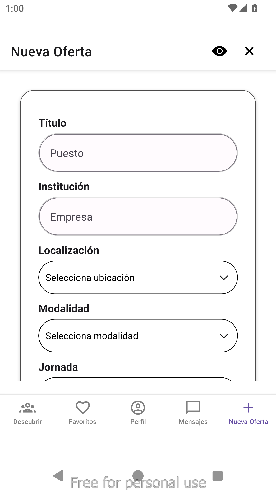</td>
    <td></td>
    <td></td>
    <td>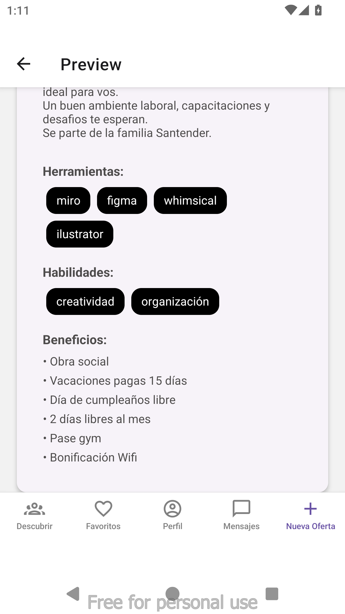</td>
   
    
  </tr>
  <tr>
    <td colspan="3" align="center">
      La sección Nueva oferta permite a los recruiters publicar nuevas ofertas de trabajo de forma sencilla, además de poder previsualizar la oferta antes de publicarla.
    </td>
  </tr>
</table>
