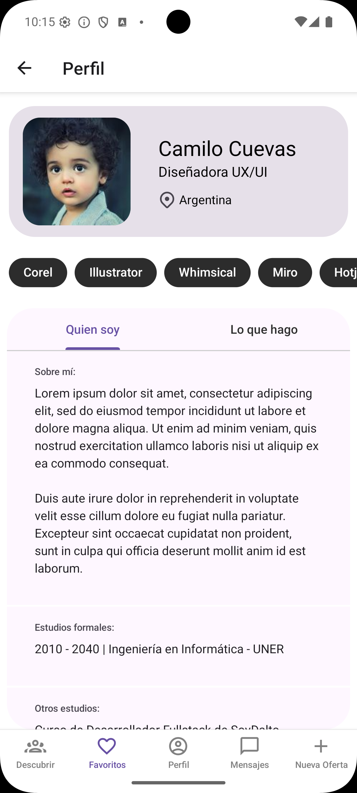
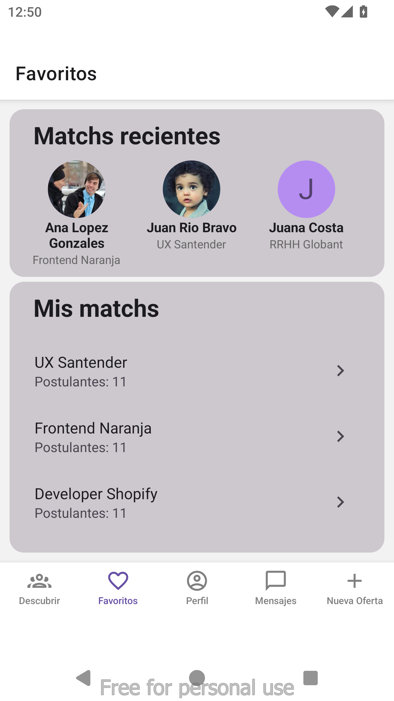
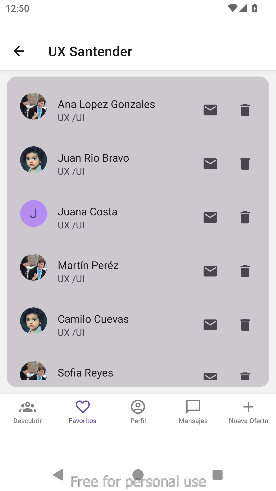
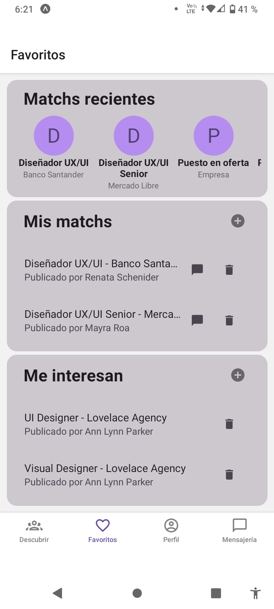
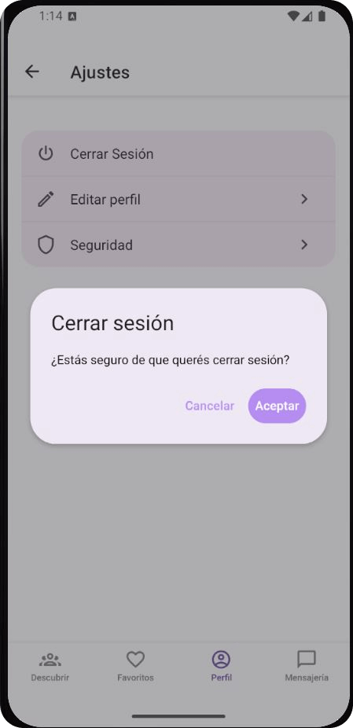
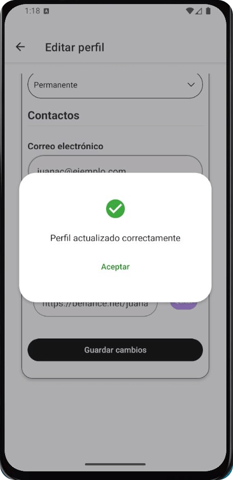
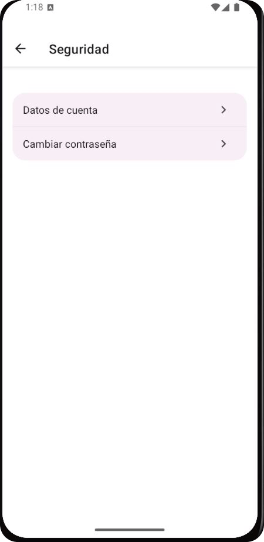

# Bienvenido a Jobsy 👋

## Tabla de Contenidos

- [Características](#características)
- [Instalación](#instalación)
- [Uso](#uso)
- [Pantallas](#pantallas)

## Características

Jobsy es una aplicación que conecta a reclutadores con profesionales.
Los reclutadores publican una oferta de trabajo, los profesionales swipean la oferta y si al reclutador le guasta el perfil del profesional entonces swipea a este produciendose el match.

## Instalación

- Para instalar las dependencias del proyecto ejecutar
  npm install

- Para correr la aplicación ejecutar
  npx expo start

## Uso

- Abrir la aplicación en el emulador o en tu dispositivo.

- Crear una cuenta o iniciar sesión.

### Inicio de sesión como reclutador

- mail: renata.reclutadora@gmail.com
  contraseña: 123456

### Inicio de sesión como profesional

- mail: juana.profesional.ux@gmail.com
  contraseña: 123456

Navegar por las distintas secciones de la app.

Explorar las funcionalidades principales.

## Pantallas

### Inicio

<table>
  <tr>
  <td></td>
    <td></td>
    <td></td>
    <td></td>
  </tr>
</table>

### Registro

<table>
  <tr>
  <td></td>
    <td></td>
    <td></td>
    <td></td>
  </tr>
</table>

### Olvide contraseña

<table>
  <tr>
  <td></td>
    <td></td>
    <td></td>
    <td></td>
  </tr>
</table>

### Descubrir profesional

#### Reclutador

<table>
  <tr>
    <td></td>
    <td></td>
   <td></td>   
   </tr>
   <tr>
    <td colspan="4" align="center">
     Permite al reclutador evaluar perfiles y matchear con los postulantes que le interesan 
    </td>
  </tr>
</table>

#### Profesional

<table>
  <tr>
    <td></td>
    <td></td>
   <td></td>
   </tr>
   <tr>
    <td colspan="4" align="center">
     Permite al profesional evaluar propuestas  y matchear con las ofertas que le interesan 
    </td>
  </tr>
</table>

### Perfil de Usuario

<table>
  <tr>
    <td></td>
    <td></td>
    <td></td>
  </tr>
  <tr>
    <td></td>
    <td></td>
    <td></td>
  </tr>
  <tr>
    <td colspan="4" align="center">
     En la sección de perfil, los usuarios profesionales pueden brindar una breve descripción de sí mismos, sus habilidades, experiencia laboral, estudios realizados e información de contacto. Además pueden compartir imágenes de su portfolio mostrando sus trabajos realizados, intereses o capturas de su día a día. En cuanto a los usuarios reclutadores mostráran un resumen de las ofertas laborales que hayan disponibilizado en la plataforma, tanto búsquedas activas como cerradas a modo de historial.
    </td>
  </tr>
</table>

### Mensajería

<table>
  <tr>
    <td></td>
    <td></td>
    <td></td>
     <td></td>

  </tr>
  <tr>
    <td colspan="4" align="center">
      La sección de mensajería permite la comunicación entre usuarios, con diseño limpio y burbujas de chat intuitivas.
      Los chats para el reclutador estan agrupados por oferta, permitiendo de esta manera que todo este ordenado de forma visual.
      Los chats para el profesional están todos juntos, debajo del nombre del reclutador se encuentra el nombre de la oferta por la que se esta comunicando.
      También permite eliminar contactos de la mensajería.
    </td>
  </tr>
</table>

### Favoritos - reclutadores

<table>
  <tr>
    <td></td>
    <td></td>
    <td></td>
    <td></td>
    
  </tr>
  <tr>
    <td colspan="4" align="center">
      La sección Favoritos posee una sección destacada con los 10 últimos match con profesionales, desde allí se puede acceder al perfil de los mismos.
      También tiene una lista de las ofertas que tienen Match odenados por oferta, al entrar a una oferta se accede al listado de profesionales, desde allí se puede acceder al perfil del profesional o a la mensajería.
    </td>
  </tr>
</table>

### Favoritos - profesionales

<table>
  <tr>
    <td></td>
    <td></td>   
    <td></td> 
    <td></td>
  </tr>
  <tr>
    <td colspan="4" align="center">
    La pantalla Favoritos presenta 3 secciones: 
      1- Matchs recientes: muestra los últimos 10 matchs con acceso a su detalle.
      2- Mis matchs: previsualiza las 2 últimas coincidencias y permite ir a la lista completa.
      3- Me interesan: previsualiza las 2 últimas postulaciones y permite acceder a la lista completa.
  </td>

  </tr>
</table>

### Nueva Oferta

<table>
  <tr>
    <td></td>
    <td></td>
    <td></td>
    <td></td>
  </tr>
  <tr>
    <td colspan="4" align="center">
      La sección Nueva oferta permite a los recruiters publicar nuevas ofertas de trabajo de forma sencilla, además de poder previsualizar la oferta antes de publicarla.
    </td>
  </tr>
</table>

### Ajustes

<table>
  <tr>
    <td></td>
    <td></td>
    <td></td>
    <td></td>   
  </tr>
  <tr>
    <td></td>
    <td></td>
    <td></td>
    <td></td>   
  </tr>
  <tr>
    <td colspan="4" align="center">
      En la pantalla "Ajustes" se encuentran las opciones "Cerrar sesión", "Editar perfil" y "Seguridad". Estas últimas dos opciones se despliegan en nuevas pantallas donde el usuario se encuentra con un formulario para editar su perfil(imagen datos) y en seguridad tenien los datos de cuenta y cambio de contraseña en sus respectivas pantallas.
    </td>
  </tr>
</table>

### Notificaciones locales

<table>
  <tr>
    <td></td>
    <td></td>
    <td></td>

  </tr>
  <tr>
    <td colspan="4" align="center">
      Notificaciones Locales: Implementación mediante expo-notifications para agendar tareas en segundo plano (scheduleNotificationAsync). Configura triggers recurrentes diarios y gestiona los permisos del dispositivo para mostrar alertas incluso si la app está cerrada, sin depender del backend.  Todos los días a las 10:00 AM se envía una notificación local que incentiva a los usuarios a volver a la app con mensajes personalizados: "쯏a viste las nuevas ofertas?" para candidatos y "쯏a viste los nuevos profesionales?" para reclutadores.
    </td>
  </tr>
</table>

### Notificaciones push

<table>
  <tr>
    <td></td>
    <td></td>
    <td></td>
    <td></td>
  </tr>
  <tr>
    <td colspan="4" align="center">
      Notificaciones Push: Sistema de alertas en tiempo real implementado con Expo Notifications. Notifica automáticamente a los candidatos cuando una oferta (mediante un usuario reclutador) hace "Match" con su perfil, asegurando una interacción inmediata. Esta notificación también es enviada al reclutador, pero se aloja en la sección notificaciones sin mostrarse el banner en pantalla debido a que el usuario se encuentra usando la aplicación en el momento del match
    </td>
  </tr>
</table>

### Permisos

<table>
  <tr>
    <td></td>
    <td></td>
    <td></td>
    <td></td>
  </tr>
  <tr>
    <td colspan="4" align="center">
      Gestión de Permisos y Privacidad
El sistema implementa un manejo robusto de los permisos nativos del dispositivo, solicitando autorización al usuario únicamente cuando es necesario y respetando su decisión de aceptarlos o denegarlos. 
<strong>Cámara y Galería:</strong> Integración mediante expo-image-picker y expo-camera para permitir a los usuarios personalizar su perfil (foto de avatar) y adjuntar contenido visual en sus publicaciones o portafolios. 
<strong>Geolocalización:</strong> Uso de expo-location para validar la ubicación en tiempo real, facilitando el "match" basado en cercanía y la creación de ofertas geolocalizadas. 
<strong>Validación de Estado:</strong> La aplicación verifica el estado de los permisos antes de ejecutar tareas críticas y ofrece feedback o alternativas si el usuario decide denegar el acceso.
    </td>
  </tr>
</table>

### Descargar y compartir CV

<table>
  <tr>
    <td></td>
    <td></td>
  </tr>
  <tr>
    <td colspan="4" align="center">
      En el perfil del profesional se puede acceder a la hoja de vida creada apartir de los datos que el usuario cargó. Esto hace más fluido, sencillo y organizado la labor del recruiter al tener la información al alcance de la mano. Por otro lado al profesional le permite tener la hoja de vida de manera fácil, agil y actualizada para su proxima entrevista.
    </td>
  </tr>
</table>